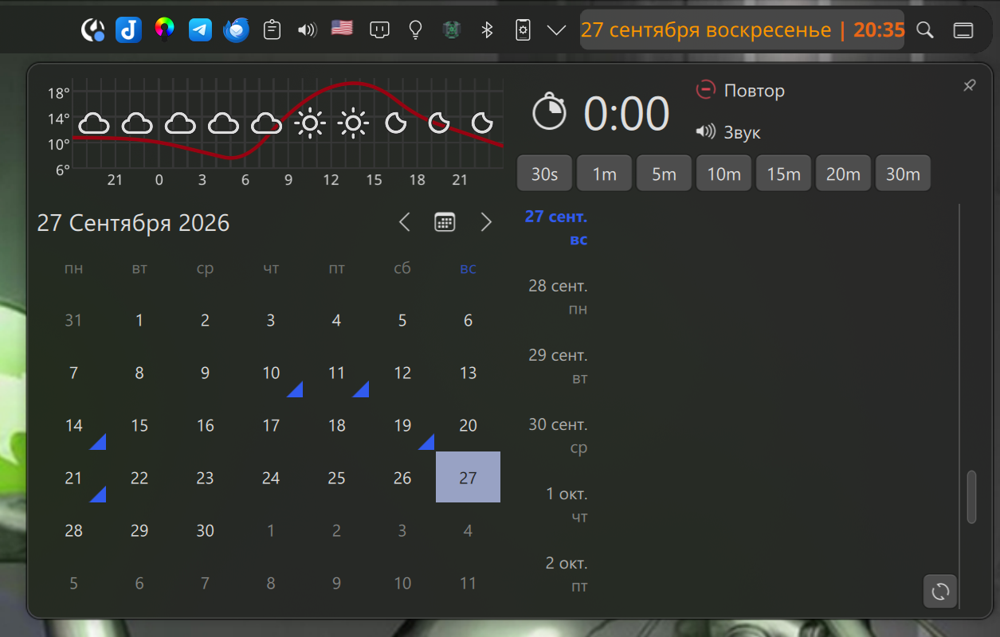
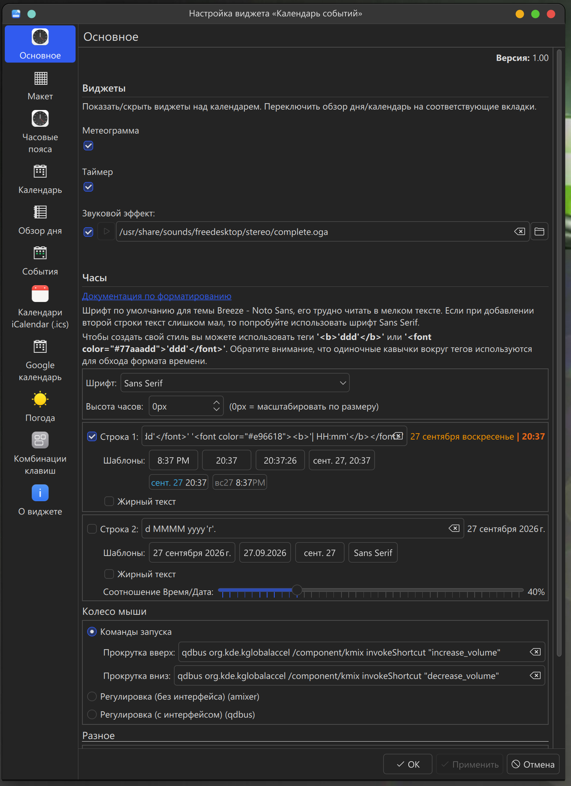
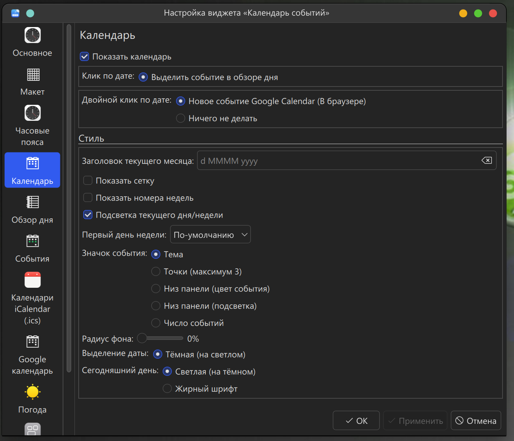
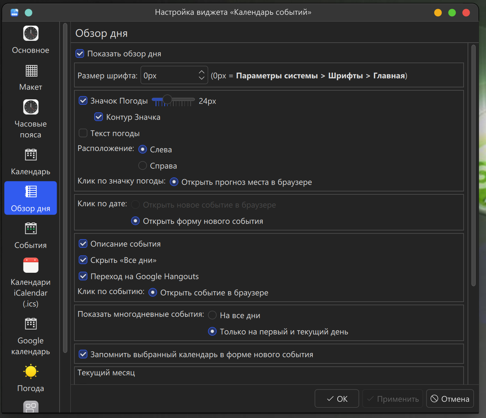

# Event Calendar

[English](README.md) | **Русский**

Plasmoid для календаря с повесткой дня, погодой и синхронизацией с Google Calendar.

**Plasma 6 / KDE Frameworks 6 / Qt 6** — Работает на Wayland и X11.

Этот проект — клон [исходного виджета Event Calendar от Zren](https://github.com/Zren/plasma-applet-eventcalendar), перенесённый на Plasma 6 и дополненный исправлениями ошибок и улучшениями совместимости.

## Скриншоты

### Окно календаря



### Настройки

| Основное | Календарь | Обзор дня |
| :------: | :-------: | :--------: |
|  |  |  |

## Требования

### Минимальные версии

| Компонент                          | Версия | Описание                                 |
| ---------------------------------- | ------ | ---------------------------------------- |
| KDE Plasma                         | ≥ 6.0  | Окружение рабочего стола                 |
| KDE Frameworks                     | ≥ 6.0  | Основные библиотеки KDE                  |
| Qt                                 | ≥ 6.6  | Фреймворк Qt                             |
| X-Plasma-API-Minimum-Version       | 6.0    | API Plasma (указано в metadata.desktop)  |

### Runtime зависимости

#### Обязательные Qt/QML модули

- `QtQuick` (Qt 6)
- `QtQuick.Controls`
- `QtQuick.Layouts`
- `Qt5Compat.GraphicalEffects` — Модуль совместимости для графических эффектов

#### Обязательные KDE модули

- `org.kde.plasma.plasmoid`
- `org.kde.plasma.core` (PlasmaCore)
- `org.kde.plasma.components` (PlasmaComponents3)
- `org.kde.plasma.plasma5support` (Plasma5Support) — для DataSource
- `org.kde.plasma.workspace.calendar` (PlasmaCalendar) — **обязательно**, предоставляется пакетом `plasma-calendar-addons`
- `org.kde.kirigami` (Kirigami)
- `org.kde.ksvg` (KSvg) — для SVG тем
- `org.kde.config` (KConfig)
- `org.kde.kcmutils` (KCMUtils) — для страниц конфигурации

#### Обязательные пакеты

| Пакет                    | Описание                                                              |
| ------------------------ | --------------------------------------------------------------------- |
| `plasma-calendar-addons` | **Обязательно!** Модуль `org.kde.plasma.workspace.calendar` для работы виджета  |

### Инструменты установки

| Пакет           | Описание                                      |
| --------------- | --------------------------------------------- |
| `git`           | Система контроля версий                       |
| `python3`       | OAuth, iCalendar и генерация metadata.json    |
| `gettext`       | Сборка переводов при установке из Git         |
| `kpackagetool6` | Установщик пакетов KDE (входит в Plasma 6)    |

### Опциональные зависимости

| Пакет              | Описание                                           |
| ------------------ | -------------------------------------------------- |
| `plasma-sdk`       | Инструменты Plasma для локального запуска виджета  |
| `kdeplasma-addons` | Дополнительные плагины календаря (праздники и др.) |
| `plasma-nm`        | Мониторинг сети (NetworkMonitor)                   |

> ⚠️ **Важно:** Пакет `plasma-calendar-addons` является **обязательным**! Без него виджет не запустится и будет показывать только иконку вместо времени.

### Python скрипты (включены в проект)

- `package/contents/scripts/icsjson.py` — Парсинг iCal календарей
- `package/contents/scripts/google_oauth.py` — OAuth-вход в Google через локальный loopback callback и PKCE
- `package/contents/scripts/konsolekalendar.py` — Интеграция с konsolekalendar
- `package/contents/scripts/notification.py` — Уведомления о событиях

Для чтения локальных и удалённых iCalendar (`.ics`) требуется Python-модуль `icalendar`.
Повторяющиеся события разворачиваются только в запрошенном диапазоне дат. Поддерживаются
`RRULE`, `RDATE`, `EXDATE`, изменённые и отменённые экземпляры `RECURRENCE-ID`, включая
изменения `THISANDFUTURE`.

### Установка зависимостей по дистрибутивам

**Arch Linux / Manjaro:**

```bash
sudo pacman -S plasma-desktop qt6-5compat git gettext plasma-nm kdeplasma-addons plasma-calendar-addons python-icalendar
```

**Debian 13 (Trixie) / Ubuntu 24.04+:**

```bash
sudo apt install kde-plasma-desktop qml6-module-qt5compat-graphicaleffects git gettext plasma-nm plasma-calendar-addons python3-icalendar
```

**Fedora:**

```bash
sudo dnf install plasma-desktop qt6-qt5compat git gettext kf6-kpackage plasma-nm plasma-calendar-addons python3-icalendar
```

**openSUSE:**

```bash
sudo zypper install plasma6-desktop qt6-qt5compat-imports git gettext plasma-nm plasma-calendar-addons python3-icalendar
```

## Установка из GitHub

```bash
git clone https://github.com/Apophuy/plasma-applet-eventcalendar.git eventcalendar
cd eventcalendar
sh ./install
```

Скрипт установки сначала собирает переводы и генерирует Plasma 6 `metadata.json` из канонического `package/metadata.desktop`, затем использует `kpackagetool6`. Если виджет уже установлен, будет выполнено обновление с автоматическим перезапуском plasmashell.

### Параметры установки

```bash
sh ./install           # Установить или обновить виджет
sh ./install --restart # Установить и принудительно перезапустить plasmashell
sh ./install -r        # То же, что --restart
```

## Обновление

Для обновления из GitHub используйте скрипт обновления:

```bash
cd eventcalendar
sh ./update
```

Скрипт выполняет `git pull` и переустановку виджета с автоматическим перезапуском plasmashell.

Альтернативный способ (ручное обновление):

```bash
cd eventcalendar
git pull
sh ./install --restart
```

## Удаление

Для удаления виджета:

```bash
cd eventcalendar
sh ./uninstall
```

Или вручную используя kpackagetool6:

```bash
kpackagetool6 -t Plasma/Applet -r org.kde.plasma.eventcalendar
```

## Разработка и отладка

### Установка для тестирования

Если вы тестируете код из разработки:

1. Сначала удалите версию из пакетного менеджера
2. Клонируйте и установите из GitHub:

```bash
git clone https://github.com/Apophuy/plasma-applet-eventcalendar.git eventcalendar
cd eventcalendar
sh ./install --restart
```

### Отладка с plasmawindowed

Для запуска текущих исходников в отдельном окне используйте `plasmawindowed`:

```bash
plasmawindowed ./package
```

### Просмотр логов

Включите отладку в настройках виджета:
- Правый клик на Calendar → **Event Calendar Settings** → **General** → `debugging = true`

Логи будут отображаться в журнале:

```bash
journalctl --user -f | grep eventcalendar
```

### После завершения тестирования

Удалите тестовую версию с помощью `sh ./uninstall` и установите предпочтительную версию.

## Настройка

### Google Calendar

1. Правый клик на Calendar → **Event Calendar Settings** → **Google Calendar**
2. Нажмите **Login with Google** — браузер откроется автоматически
3. Войдите в Google и разрешите доступ к Calendar и Tasks; после локального перенаправления вернитесь в настройки виджета
4. После того, как окно настроек покажет статус синхронизации, нажмите **Apply**

Авторизация использует loopback callback на `127.0.0.1` и PKCE. Для запуска локального callback требуется `python3`; вход одинаково работает в сеансах Wayland и X11.

### Google Tasks

1. В той же вкладке **Google Calendar** включите интеграцию с Tasks
2. Выберите списки задач для отображения

### Погода (OpenWeatherMap)

1. Перейдите на вкладку **Weather**
2. Введите ID вашего города для OpenWeatherMap
3. Если поиск не находит ваш город, используйте Google: [site:openweathermap.org/city название_города](https://www.google.com/search?q=site%3Aopenweathermap.org%2Fcity)

**Альтернатива:** Weather Canada (для городов Канады)

### Календари iCalendar (.ics)

1. Перейдите на вкладку **Календари iCalendar (.ics)**
2. Добавьте локальный файл `.ics` или URL календаря
3. Интеграция работает в режиме чтения: события из источника отображаются в календаре и повестке

### Плагины календарей Plasma

Виджет поддерживает плагины календаря Plasma (например, для праздников):

1. Установите `kdeplasma-addons`
2. В настройках **События** включите нужные плагины
3. Доступные плагины обычно находятся в `/usr/lib/qt6/plugins/plasmacalendarplugins/` или `/usr/lib64/qt6/plugins/plasmacalendarplugins/`:
   - `holidaysevents.so` — праздники (включен по умолчанию)

## Возможности

### Основные функции

- **Календарь** — месячный вид с отображением событий
- **Повестка дня** — список событий на следующие 14 дней
- **Погода** — текущая погода и прогноз (OpenWeatherMap / Weather Canada)
- **Метеограмма** — почасовой график температуры и осадков
- **Таймер** — встроенный таймер с предустановками

### Интеграция с календарями

- Google Calendar (события и задачи)
- iCal календари (.ics)
- Плагины календаря Plasma (праздники и др.)

### Уведомления

- За 15 минут до начала события (настраивается)
- При начале события
- Завершение таймера
- Настраиваемые звуковые эффекты

### Настройки отображения

- Двухколоночный или одноколоночный режим
- Настройка размеров виджета
- Кастомные цвета и стили
- Формат времени (12/24 часа)
- Первый день недели
- Границы ячеек календаря
- Радиус закругления ячеек

## Устранение неполадок

### Виджет не появляется после установки

Перезапустите plasmashell:

```bash
# Через systemd (рекомендуется)
systemctl --user restart plasma-plasmashell.service

# Если служба недоступна, выйдите из сеанса Plasma и войдите снова
```

### Ошибки синхронизации Google Calendar

1. Проверьте подключение к интернету
2. Выйдите и войдите заново в Google Calendar через настройки
3. Убедитесь, что виджет обновлен до последней версии

### Погода не обновляется

1. Проверьте правильность City ID в настройках
2. Убедитесь, что есть интернет-соединение
3. OpenWeatherMap может ограничивать запросы (HTTP 429) — подождите час

### Проблемы после обновления Plasma

После обновления с Plasma 5 на Plasma 6:

```bash
cd eventcalendar
sh ./uninstall
sh ./install --restart
```

## Структура проекта

```
package/
├── metadata.desktop           # Канонические метаданные плагина
├── metadata.json              # Генерируется build/install, в Git не хранится
├── contents/
│   ├── config/
│   │   ├── config.qml        # Категории настроек
│   │   └── main.xml          # Схема конфигурации (все параметры)
│   ├── ui/
│   │   ├── main.qml          # Точка входа (PlasmoidItem)
│   │   ├── Logic.qml         # Оркестрация обновлений
│   │   ├── EventModel.qml    # Модель событий
│   │   ├── AgendaModel.qml   # Модель повестки дня
│   │   ├── PopupView.qml     # Основной UI виджета
│   │   ├── ClockView.qml     # Компактное представление (часы)
│   │   ├── calendars/        # Интеграция с календарями
│   │   │   ├── CalendarManager.qml
│   │   │   ├── GoogleCalendarManager.qml
│   │   │   ├── GoogleTasksManager.qml
│   │   │   ├── PlasmaCalendarManager.qml
│   │   │   └── ICalManager.qml
│   │   ├── weather/          # API погоды
│   │   ├── config/           # UI настроек
│   │   └── lib/              # Вспомогательные библиотеки
│   └── scripts/
│       ├── icsjson.py        # Парсинг iCal
│       ├── konsolekalendar.py
│       └── notification.py   # Уведомления
└── translate/                 # Переводы (18 языков)
```

## Архитектура

### Поток данных

```
CalendarManagers → EventModel → AgendaModel → UI Views
     ↓
GoogleCalendarManager, PlasmaCalendarManager, ICalManager
```

### Ключевые компоненты

- **CalendarManager** — базовый класс для менеджеров календарей
- **EventModel** — агрегация событий из всех источников
- **AgendaModel** — преобразование событий для отображения в повестке
- **Logic.qml** — обновление данных, опрос, получение погоды

### Конфигурация

- `Plasmoid.configuration.*` — доступ к настройкам из `main.xml`
- `AppletConfig` — хелперы для конфигурации
- `ConfigMigration.qml` — миграция старых настроек при обновлении

## Локализация

Поддерживаемые языки:
- Русский (ru)
- Английский (по умолчанию)
- Немецкий (de)
- Испанский (es)
- Финский (fi)
- Французский (fr)
- Иврит (he)
- Итальянский (it)
- Японский (ja)
- Корейский (ko)
- Голландский (nl)
- Польский (pl)
- Португальский BR (pt_BR)
- Португальский PT (pt_PT)
- Словенский (sl)
- Шведский (sv)
- Турецкий (tr)
- Украинский (uk)
- Китайский (zh_CN)

### Для переводчиков

```bash
cd package/translate
sh ./merge  # Обновить template.pot из i18n() вызовов
sh ./build  # Скомпилировать .po → .mo файлы
sh ./plasmoidlocaletest ru  # Тестирование русского интерфейса с plasmawindowed
```

## Лицензия

GPL — см. исходный код для деталей

## Авторы

- **Apophuy** — разработчик и сопровождающий проекта
- GitHub: https://github.com/Apophuy/plasma-applet-eventcalendar

## Благодарности

Переводчики, контрибьюторы и сообщество KDE за поддержку проекта.

## Версия

Текущая версия: **1.00** (см. `package/metadata.desktop`)

История изменений: [Changelog.md](Changelog.md)
